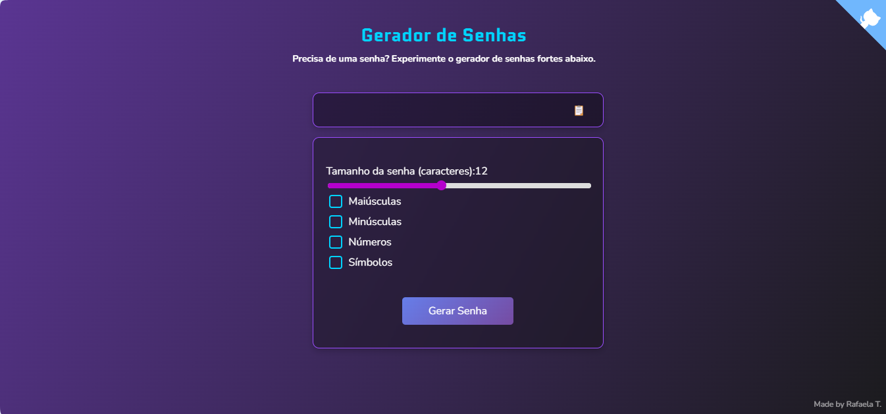

# 🔐 Gerador de Senhas

Um gerador de senhas seguro e personalizável, desenvolvido com HTML, CSS e JavaScript.

## 🚀 Funcionalidades

- Geração de senhas aleatórias
- Personalização de tamanho da senha
- Opção para incluir números, símbolos e letras maiúsculas
- Copiar senha com um clique

## 🎨 Captura de Tela

## 🛠️ Tecnologias Usadas

- HTML5
- CSS3
- JavaScript

## 🛠 Melhorias Futuras
- Design responsivo para telas pequenas;
- Adicionar animações para uma experiência mais fluida;
- Criar uma versão em React para prática.

#
Feito com ♡ por Rafaela T.

Este projeto foi criado apenas para fins de aprendizado e portfólio. Caso queira utilizá-lo ou modificá-lo, entre em contato.
